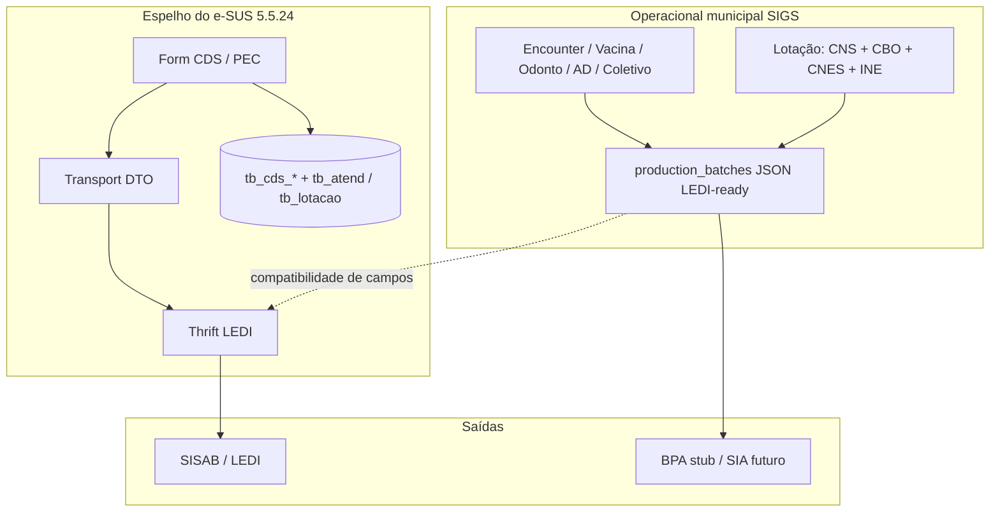

# Legado e-SUS → produção / faturamento (reescrita detalhada)

**Versão analisada:** e-SUS APS **5.5.24**  
**Atualizado:** 2026-08-10  
**Confiança:** `DIRECT_SOURCE` (Thrift, converters, enums, inventário de tabelas)  
**Regra:** descrever o que **esta build** faz; não copiar código; não assumir = norma legal vigente.

---

## 1. O ponto crítico: dois “faturamentos” diferentes

No APS federal e no TR municipal convivem **dois pipelines** que o time costuma chamar de “faturamento”, mas **não são o mesmo artefato**:

| Canal | Destino típico | Formato no e-SUS APS | O que conta |
|---|---|---|---|
| **Produção APS (SISAB)** | Ministério / LEDI | Fichas Thrift (`pec-ledi-thrift`) | Financiamento APS, indicadores, espelho CDS |
| **Faturamento ambulatorial (SIA)** | Fundo municipal / BPA–APAC | Layout SIA (fora do núcleo LEDI) | Procedimentos SIGTAP, competência, CBO, CNES |

**Implicação TR Franca:** o e-SUS APS é fonte excelente para **LEDI/SISAB**. BPA/APAC reais **não** nascem automaticamente do mesmo jar Thrift — no inventário SIGTAP/BPA aparecem só como hits fracos. No SIGS hoje:

1. Atendimento/vacina/odonto/AD/coletivo → `production_batches` com payload **LEDI-equivalente** (JSON).
2. `GET /production/bpa/export` → **BPA stub v0** (mapa fixo `kind → código SIGTAP`), enriquecido pelo catálogo SIGTAP **local** (seed/import).

Sem download MS do SIGTAP, **dá para aprofundar (1) e a fidelidade do mapa LEDI**; o layout BPA oficial e o catálogo mensal completo ficam bloqueados/parciais.



---

## 2. Cadeia de dados no legado (como o e-SUS “trata” para enviar)

### 2.1 Camadas (JARs)

| Camada | JARs P0 | Papel |
|---|---|---|
| UI / Form | `esus.web`, presentation | Captura clínica |
| Domínio / regras | `model`, `cds.service.*`, `pec.business.impl`, `validation` | Valida enums, CBO, regras vacinais |
| Persistência operacional | `database` (Liquibase), `*.persistence`, `data` | `tb_atend`, `tb_lotacao`, `tb_cidadao`… |
| Persistência CDS | tabelas `tb_cds_*` | Espelho da ficha antes/depois do envio |
| Transport | `cds.common.api` DTOs + converters | Form → Transport |
| Serialização LEDI | `*Transport2Thrift` + `pec-ledi-thrift` | Transport → Thrift |
| Envio | `transport.*`, `pec.transport.business.impl`, sync | Fila / transmissão |

### 2.2 Exemplo concreto — Atendimento Individual

Fonte decompilada:

- `FichaAtendimentoIndividualChildConverter` (Form → Transport)
- `FichaAtendimentoIndividualMasterTransport2Thrift` (Transport → Thrift)
- `LotacaoHeaderThrift` / `VariasLotacoesHeaderTransport`

```text
Atendimento clínico (PEC)
  → FichaAtendimentoIndividualChildForm
  → FichaAtendimentoIndividualChildConverter
       • cpf → cpfCidadao
       • turno → CdsTurnoDbEnum.id (long)
       • tipoAtendimento → TipoAtendimentoDbEnum.id
       • condutas → List<TipoEncaminhamentoIndividualDbEnum.id>
       • peso/altura/PC → medicoes.*
       • problemaCondicao → problemasCondicoes / CIAP-CID
       • exames OutrosSia → solicitado vs avaliado
  → FichaAtendimentoIndividualChildTransport
  → MasterTransport (header lotação + lista children + uuidFicha + tpCdsOrigem)
  → MasterTransport2Thrift
       → VariasLotacoesHeaderTransport2Thrift
       → ChildTransport2Thrift (por atendimento)
  → FichaAtendimentoIndividualMasterThrift
  → transmissão LEDI
```

**Header de lotação (obrigatório conceitualmente para produção válida):**

`LotacaoHeaderThrift`:

| Campo | Origem típica legado |
|---|---|
| `profissionalCNS` | `tb_prof` / lotação ativa |
| `cboCodigo_2002` | `tb_lotacao` |
| `cnes` | `tb_unidade_saude` |
| `ine` | `tb_equipe` (quando aplicável) |

`VariasLotacoesHeaderTransport` ainda carrega `dataAtendimento` + `codigoIbgeMunicipio` (+ lotação compartilhada opcional).

### 2.3 Transformações que o SGS precisa reimplementar (sem copiar)

| Transformação legado | Onde | No SIGS |
|---|---|---|
| Enum domínio → `Long` id | `DbEnumIdAttributeConverter` | Catálogo próprio `id ↔ código ↔ label` |
| Lista de condutas → ids | `ListDbEnumIdAttributeConverter` | Mapear `ALTA`/`RETORNO`/… → ids LEDI |
| CPF form → `cpfCidadao` | ChildConverter | Já no mapper individual |
| Medidas → `medicoes` | ChildConverter | Parcial no mapper |
| Exames OutrosSia → 2 listas | `fillOneFields` | Ainda não |
| Lotação → header | VariasLotacoes* | **Gap:** header SIGS ainda simplificado (falta CBO/IBGE estruturados) |

### 2.4 Status da ficha no legado (conceito)

Operacionalmente as fichas CDS transitam por estados do tipo rascunho / não enviada / enviada (vacinação documenta isso explicitamente). No SIGS isso vira:

`production_batches.status`: `ready` → `sent` (+ futuro `draft` / `error` / `rejected`).

---

## 3. Banco de dados legado → modelo SIGS

Documento base: `data/esus/5.5.24/analysis/data-model.md`.

### 3.1 Tabelas que alimentam produção

| Tabela legado | Papel na produção | Entidade SIGS atual / alvo |
|---|---|---|
| `tb_lotacao` | CNS+CBO+CNES+INE no header | `ProfessionalAssignment` ✅ (novo) |
| `tb_unidade_saude` | CNES | `Facility` |
| `tb_prof` | CNS profissional | `Professional` |
| `tb_equipe` | INE | `Team` |
| `tb_cidadao` | CPF/CNS/sexo/nasc | `Patient` (+ endereço ✅) |
| `tb_prontuario` | Nº prontuário / vínculo | **gap** MedicalRecord |
| `tb_atend` / `tb_atend_prof` | Encontro + profissional | `Encounter` |
| `rl_atend_proced` | Procedimentos no encontro | clinicalJson / futuro |
| `tb_cds_ficha_atend_individual` | Master CDS | espelhado em `production_batches.payloadJson` |
| `tb_cds_atend_individual` + `rl_cds_*` | Child + CIAP/conduta/exame | idem |
| `tb_cds_ficha_vacinacao` / rows | Ficha vacina | `VaccinationRecord` + batch |
| `tb_fat_*` (DW) | Analítico | **não** portar 1:1 |

### 3.2 O que NÃO copiar

- Prefixo `tl_*` (log legado) → auditoria própria (`AuditEvent`).
- Schema Liquibase inteiro → só o núcleo MVP + ganchos de produção.
- Thrift Java no runtime Nest → **compatibilidade de campos/códigos** em JSON.

### 3.3 Já decompilado e útil (sem precisar de SIGTAP)

| Artefato | Caminho |
|---|---|
| Thrift LEDI | `data/esus/5.5.24/decompiled/raw/pec-ledi-thrift-6.2.10/` |
| Converters AI | `.../cds.common.api-5.5.24/.../converters/atendimentoindividual/` |
| Transport2Thrift | `.../generated/converter/*Transport2Thrift.java` |
| Enums | `model-5.5.24` (`CdsTurnoDbEnum`, `TipoAtendimentoDbEnum`, …) |
| Specs LEDI | `data/esus/5.5.24/spec/ledi/*.md` |

**Ainda fraco / a extrair:** changelog Liquibase completo do `database-5.5.24.jar` (listar colunas 1:1), `pec.transport.business.impl` (fila de envio), enums de conduta com ids numéricos exportados para seed SIGS.

---

## 4. Como o SIGS trata hoje (estado real)

| Kind do lote | Origem | Payload | BPA stub (código fixo) |
|---|---|---|---|
| `individual_encounter` | `encounters.finish` | LEDI individual (parcial) | `0301010064` |
| `vaccination` | aplicação vacina | LEDI vacina (parcial) | `0301010030` |
| `dental_encounter` | odonto finish | stub | `0101020010` |
| `home_care` | AD finish | stub | `0101040024` |
| `collective_activity` | coletivo finish | stub | `0101050011` (+ qty participantes) |

Export: `ProductionService.exportBpa` → `buildBpaStub` → `SigtapService.enrichProcedureCodes` (known/unknown no catálogo **local**).

**Lacunas vs legado (impacto direto em “faturamento/produção”):**

1. Header sem `cboCodigo_2002` / IBGE estruturados → **parcialmente fechado** (CBO + `lotacaoFormPrincipal` no mapper v2; IBGE via env `SIGS_IBGE_MUNICIPIO`).
2. Condutas/turno/tipo como **strings** amigáveis → **fechado no AI/vacina** (ids numéricos + labels); odonto/AD/coletivo ainda stub.
3. Odonto/AD/coletivo/procedimento sem mapeamento Thrift campo a campo (só stub BPA).
4. Sem `FichaProcedimento` / OutrosSia (exames) no pipeline.
5. BPA = stub interno, não layout DATASUS.
6. Catálogo SIGTAP mensal depende de download MS (adiado) — seed local cobre só códigos do stub.

---

## 5. O que dá para implementar **sem** download SIGTAP

Prioridade sugerida (maior valor / menor bloqueio externo):

### P0 — Fidelidade LEDI + lotação (**feito 2026-08-10**)

1. ~~Plugar lotação no finish~~ → `resolveLotacaoHeader` + finish AI/vacina.  
2. ~~Catálogo de enums LEDI~~ → `apps/api/src/ledi/db-enums.ts` + `GET /v1/ledi/enums`.  
3. ~~Mapper individual v2~~ → ids + `lotacaoFormPrincipal`.  
4. Validação pré-lote → preflight já cobre; reforçar com ids numéricos.

### P1 — Completar fichas espelho APS (ainda sem SIGTAP MS)

5. ~~Mapeamentos LEDI: **odonto**, **AD**, **atividade coletiva**~~ → `ledi-*-v2` (2026-08-11).  
6. Extrair ids/`_Fields` dos ChildThrift ainda “resumo” (vacina child, etc.).
7. ~~Lifecycle de lote: `draft` / `ready` / `sent` / `error` + reprocessar~~ → 2026-08-11.
8. Decompilar `pec.transport.business.impl` + documentar fila de envio (mesmo que o “sent” continue local).
9. **Ficha procedimento** ainda stub.

### P2 — Banco / cadastros que o LEDI exige

9. Inventário Liquibase → `analysis/entities.json` + gaps Prisma.
10. **Prontuário** (`tb_prontuario`) mínimo + nº no child LEDI.
11. ~~Município IBGE no header~~ → `Facility.ibgeCode` + UI `/unidades` (2026-08-11).

### P3 — Faturamento SIA (parcial sem zip MS)

12. ~~Manter/expandir **seed SIGTAP**~~ → ~27 códigos + sync + `piloto-franca.json` (2026-08-11).
13. Quando o download voltar: `import-ms` já existe; só alimentar competência.
14. Layout BPA oficial DATASUS = fatia separada (norma SIA), **não** misturar com Thrift LEDI.

### Fora / adiados (confirmados)

- SAMU, LIS, TFD.
- DW `tb_fat_*`.
- APAC/AIH completos sem módulo hospitalar.

---

## 6. Checklist de reescrita “fiel” (DoD por ficha)

Para cada tipo de ficha LEDI:

- [ ] Spec `data/esus/.../spec/ledi/<ficha>-mapping.md` com tabela domínio ↔ Thrift
- [ ] Enums seedidos com **ids** iguais ao legado (ou tabela de equivalência versionada)
- [ ] Mapper Nest + testes (campos obrigatórios + 1 caso off-happy-path)
- [ ] `production_batches.kind` + RF na matriz + `teste_faturamento`
- [ ] Manual técnico (caminho do lote até export)
- [ ] Export BPA stub consome o payload (CBO/CNS/CNES reais, não só código fixo)

---

## 7. Fontes no repositório

| Tema | Onde |
|---|---|
| JARs / camadas | `docs/conhecimento/03-jars-e-arquitetura-bridge.md` |
| Integrações / gaps | `docs/conhecimento/05-integracoes-e-gaps.md` |
| Data model | `data/esus/5.5.24/analysis/data-model.md` |
| LEDI individual | `data/esus/5.5.24/spec/ledi/individual-encounter-mapping.md` |
| LEDI vacina | `data/esus/5.5.24/spec/ledi/vaccination-mapping.md` |
| Mapper SIGS | `apps/api/src/encounters/ledi-individual.mapper.ts` |
| BPA stub | `apps/api/src/production/bpa-stub.mapper.ts` |
| Thrift bruto | `data/esus/5.5.24/decompiled/raw/pec-ledi-thrift-6.2.10/` |
| Converters | `.../cds.common.api-5.5.24/.../converters/` |

---

## 8. Decisão de produto (recomendada)

Enquanto o download SIGTAP estiver indisponível, **não esperar o MS**. Avançar o **P0 (LEDI + lotação + enums)**: é exatamente o trecho em que o legado “trata os dados para enviar”, e é o que o SISAB / produção APS realmente consome. O BPA stub continua como gancho municipal de teste, enriquecido pelo seed local.
