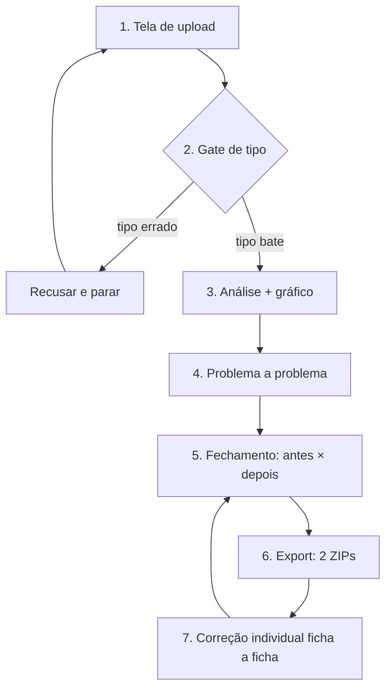

# Plano de UI — wizard único de lote LEDI (FAI / FAO / Procedimentos)

**Status:** plano (não implementar o wizard nesta entrega)  
**Data:** 2026-08-14  
**Fonte:** instrução do usuário — fluxo de trabalho otimizado para upload de lotes  
**Telas:** `/faturamento/lote/fai` · `/faturamento/lote/fao` · `/faturamento/lote/proc`  
**Shell compartilhado:** `LediTipoLotePage`

Documento irmão: [plano-ledi-validacao-correcao-100.md](plano-ledi-validacao-correcao-100.md) (pipeline de códigos e repair). Este arquivo trata **só da jornada de interface**.

---

## Entendimento

Um **wizard único** nas três telas de lote: a pessoa sobe o ZIP e o sistema **abre ficha a ficha**; correções automatizáveis entram sozinhas; o que exige pessoa vai para tratamento depois. Antes de qualquer análise, um **gate de tipo** recusa o arquivo se as fichas não forem da tela (FAO na FAI, etc.) e **volta ao início** — não segue diagnóstico. Se o tipo bater, a análise mostra gráfico (quantidade, já podem enviar, erros, quantos corrigem em **lote**, quantos **individuais**). Em seguida um fluxo **problema a problema**, do mais grave e abrangente ao menos grave e menos abrangente (ordem atual BLOCKER → qualidade → indicadores). No fechamento: campos corrigidos + status **pronto Siaps** (pode enviar) vs **pronto Previne** (qualidade/indicador) vs **100% OK** (Siaps+Previne), com gráfico **antes × depois**. Export em dois ZIPs claros: aptos para envio vs os que ainda precisam correção. O que restar de pessoa entra em tela **ficha a ficha** (não um mar de lista) antes de fechar o lote final.

**Três estados (não misturar):**

| Rótulo na UI | Significado | Campo hoje |
|---|---|---|
| **Pronto Siaps** | Pode enviar ao Ministério / produção entra | `siapsReady` (sem BLOCKER) |
| **Pronto Previne** | Qualidade / indicador (FAO: ESB B1–B6; FAI/PROC: qualidade LEDI) | `previneReady` / avisos de qualidade |
| **100% OK** | Siaps **e** Previne | `readyForFinalSend` |

---

## Fluxo em etapas



### Wireframe textual

**Etapa 1 — Upload** (estado inicial; sem lote aberto)

```
┌─────────────────────────────────────────────────────────────┐
│ Lote LEDI {FAI | FAO | PROC}                                 │
│                                                             │
│ O sistema abre ficha a ficha.                               │
│ • Correções automatizáveis serão feitas pelo sistema.       │
│ • O que precisa de pessoa vai para tratamento posterior.    │
│                                                             │
│ Pronto Siaps  = pode enviar                                 │
│ Pronto Previne = qualidade / indicador                      │
│ 100% OK        = Siaps + Previne                            │
│                                                             │
│ [ nome do lote ]  [ soltar ZIP aqui ]                       │
└─────────────────────────────────────────────────────────────┘
```

Não misturar nesta tela: fila nativa APS/odonto, lista de lotes recentes (pode ficar abaixo, recolhida), nem o diagnóstico.

**Etapa 2 — Gate de tipo** (bloqueante; sem análise)

- Amostra / detecção `tipoDadoSerializado` (4 FAI · 5 FAO · 7 PROC).
- Se **não** for da tela: mensagem clara (“este ZIP é FAO; abra Lote FAO”), **não persiste lote**, **não** dispara job de análise, botão **voltar ao início**.
- Se bater: segue etapa 3 (upload em chunks como hoje).

**Etapa 3 — Análise + gráfico** (só depois do gate)

Contagens no mesmo card (funil + pizza já existentes, com rótulos novos):

1. Quantidade de fichas  
2. Já podem enviar (pronto Siaps)  
3. Erros encontrados (por severidade)  
4. Quantos **corrigem em lote** (`autoFixable` / repair `auto`+`semi`)  
5. Quantos **individuais** (pessoa / ficha)

Job async: poll “processando ficha n de m” (já existe).

**Etapa 4 — Problema a problema** (modal sequencial)

Fila ordenada: **BLOCKER (mais fichas primeiro) → qualidade/MONEY_RISK → indicadores**.  
Um problema por vez: o que é, quantas fichas, **Corrigir em lote** se seguro, ou **deixar para individual**. **Próximo problema** (não um painel de 16 barras para clicar à vontade como passo principal).

**Etapa 5 — Fechamento da análise**

- Quantos **campos** corrigidos (não só fichas tocadas).  
- Status atual: aptas envio / aptas Previne / 100% OK.  
- Gráfico **antes × depois** do tratamento (baseline no upload vs agora).

**Etapa 6 — Export**

Dois pacotes, nomes explícitos (não “ZIP atuais” genérico):

1. **Aptos para envio** — prontos Siaps (podem ir ao Siaps agora).  
2. **Ainda precisam correção** — o restante (bloqueio e/ou qualidade), para a secretaria / etapa 7.

**Etapa 7 — Correção individual**

Tela **uma ficha por vez**: o que falta nesta ficha, salvar, **próxima**.  
Não é a tabela rolável de milhares de linhas como passo principal. A lista pode existir como busca/atalho, recolhida.

---

## Telas atuais vs alvo

O wizard **reusa** o shell e os contratos; muda a **orquestração** (passos + copy + gate duro + dois ZIPs + ficha-a-ficha).

| Peça | Hoje | Alvo no wizard |
|---|---|---|
| `LediTipoLotePage` | Uma página longa: upload + diagnóstico + barras + export + **tabela de fichas** | Orquestrador dos 7 passos; mesmas 3 rotas |
| Copy do upload | Técnico (ZIP 100 MB, fatias Safari, links de fila) | Texto do entendimento (ficha a ficha, auto vs pessoa, Siaps/Previne/100% OK). Detalhe Safari **abaixo**, não no lead |
| Gate de tipo | Cliente: `assertLediTipoMatch` **não roda no ZIP** (`shouldUnzipZipInBrowser` = false). Servidor: marca `WRONG_FICHA_TIPO` **por ficha e continua a análise** | **Recusar o lote inteiro e parar.** Não criar batch / abortar job. Voltar à etapa 1 |
| `LediFunnelCharts` | Funil + pizza (total, bloqueio, qualidade, indicadores, ideais) | Etapa 3 + etapa 5 (série **antes × depois**) |
| `LoteQualityPanel` | Total / Siaps / Previne ou qualidade / envio final OK | Etapa 5: mesmos três estados com os rótulos do entendimento |
| `TreatmentDashboard` | Buckets clicáveis (bloqueio → risco → indicadores → ideal) | Alimenta a **ordem** da etapa 4; não compete com o gráfico principal |
| Barras `topCodes` + `ErrorGuideModal` | Clique numa barra abre o guia | Etapa 4: **fila sequencial** (reusar o modal; avançar automaticamente) |
| Autofix job (`POST …/dry-run\|auto-fix` → 202 + poll) | Dry-run / corrigir em lote no painel de export | Etapa 4 (por problema) e resumo na 5. Chunks 100–200 **inalterados** |
| `PendingReportPanel` + PDF secretaria | Relatório do que falta (JSON/CSV/MD/PDF) | Apoio da etapa 5/7; não substitui o wizard |
| Export ZIP | `zip-conformant` (Siaps) + `zip-current` (**todas** as atuais) | Dois pacotes: **aptos envio** vs **ainda precisam correção** (o 2º **não** inclui as já aptas) |
| `FichaFixModal` | Aberto a partir da **tabela** (seção “4. Fichas”) | Etapa 7: **próxima ficha** com gaps; tabela vira busca opcional |
| `LediJobProgressModal` / poll | Import ZIP + autofix | Etapas 2–4: progresso visível; gate falho **não** entra no poll de análise |
| Upload chunk Safari | `ledi-zip-client` / `ledi-batch-upload` 512 KiB + XHR | **Não mexer** no caminho de bytes; só quando o job **começa** (depois do gate) |

**Não reescrever nesta mudança:** validadores, registry de erros, PDF, filas `/faturamento/aps` e `/odonto`, fichas clínicas `/aps/[id]` e `/odonto/[id]`.

---

## Plano de implementação (ondas)

Fora desta tarefa: **não** implementar o wizard. Copy na tela de upload só se for stub de uma frase **sem** alterar o fluxo; preferência: só este documento.

### P0 — Copy + gate + gráficos

- Copy da etapa 1 (Siaps ≠ Previne ≠ 100% OK; auto vs pessoa).  
- Gate duro no **servidor** (e no cliente se houver amostra): tipo divergente → HTTP de recusa, **sem** persistir itens, job de import **não** analisa. UI: alerta + voltar.  
- Gráfico da etapa 3: incluir fatias **corrigem em lote** vs **individuais** (derivar de `autoFixableItems` + `treatment` / registry `repairClass`).  
- Rótulos do funil alinhados aos três estados.

**DoD P0:** ZIP do tipo errado não gera lote analisável; ZIP certo mostra as 5 contagens; upload chunk Safari intacto.

### P1 — Modal sequencial

- Fila de problemas: `compareBySeverityThenCount` (já usado nas barras) como **passo obrigatório**, não clique opcional.  
- Reusar `ErrorGuideModal` + autofix job por código (ou lote seguro já existente).  
- “Próximo problema” / “deixar para individual”.  
- Ordem: BLOCKER → qualidade → indicadores (igual à prioridade atual da página).

**DoD P1:** após a análise, o primeiro modal abre sozinho no BLOCKER mais abrangente; fechar o último problema leva à etapa 5.

### P2 — Ficha a ficha

- Substituir a tabela como passo principal por **uma ficha visível** (`FichaFixModal` + “próxima”).  
- Fonte: itens com finding residual, ordenados pela mesma severidade.  
- Lista/tabela: busca / “ir para arquivo”, não o fluxo default.  
- Integração com `pending-report` (o que falta nesta ficha).

**DoD P2:** lote de milhares de fichas não exige scroll de tabela para corrigir o residual.

### P3 — Polish

- Gráfico **antes × depois** (baseline no `treatment` já existe em parte; dry-run já devolve `before`/`after` Siaps).  
- Contagem de **campos** corrigidos (hoje o dry-run fala fichas tocadas).  
- Export: segundo ZIP = só pendentes; nomes dos arquivos (`…-aptos-envio.zip` / `…-pendentes.zip`).  
- Copy Safari / retomar fatia só no rodapé da etapa 1.  
- Manual usuário stub das 3 telas + matriz RF se o passo ganhar tela nova.

**DoD P3:** fechamento mostra campos + três status + antes/depois; dois ZIPs inequívocos.

---

## Riscos

| Risco | Por que importa | Mitigação |
|---|---|---|
| **Safari + ZIP grande** | Fatias 512 KiB + XHR; `blob.arrayBuffer()` no ZIP inteiro é proibido. Gate **não** pode voltar a unzipar no browser | Gate no **servidor** após a 1ª fatia unzipável (amostra no job **antes** do loop de validate). Cliente só mostra a recusa do 202/erro. Não reativar `shouldUnzipZipInBrowser` |
| **Job async** | Import e autofix já são 202 + poll; lote FAI ~8k fichas. Wizard sequencial não pode assumir resposta síncrona | Cada passo consome o mesmo `GET /v1/jobs/:id`. Recusa de tipo = falha **cedo** do job (antes do validate em massa), com mensagem estável para a UI |
| Gate vs lote misto | Dump real às vezes mistura tipos no mesmo ZIP | Política P0: **qualquer** ficha fora do tipo da tela recusa o **ZIP inteiro** (pedido: não seguir análise). Não “seguir as que bateram”. Documentar no alerta: separe os tipos e envie na tela certa |
| Dois ZIPs vs `zip-current` | `export.zip?mode=current` hoje inclui **aptas + pendentes** | Novo modo `pending` (ou filtro `!siapsReady`) sem remover `current` até P3 (compat interna). UI do wizard só oferece os dois pacotes claros |
| Modal empilhado | `ErrorGuideModal` + `FichaFixModal` + job progress | Um fluxo visível por vez (já houve scroll-lock). P1: guia sequencial; P2: ficha; job em overlay não empilha terceiro editor |
| Fase 2 UI (Claude Design) | Wizard desta fase é shell técnico | Contratos (summary, jobs, export) estáveis para a fase 2 só trocar o visual |

---

## Fora de escopo deste documento

- Implementar o wizard (código).  
- Inventar CIAP/CID/conduta no autofix.  
- Mudar LEDI/validadores além do **fail-closed** do gate.  
- UI final Claude Design (`docs/design/`).

---

## Rastreio

| Item | Nota |
|---|---|
| RF | Faturamento / produção LEDI (export testável). Marcar Obrigatório vs Desejável na matriz quando P0–P2 ganharem tela |
| Fonte | Pedido de produto (fluxo operacional Franca), não cópia e-SUS |
| Teste de produção | ZIP tipo certo → summary + export aptos; ZIP tipo errado → 0 lote; dois ZIPs na P3 |
